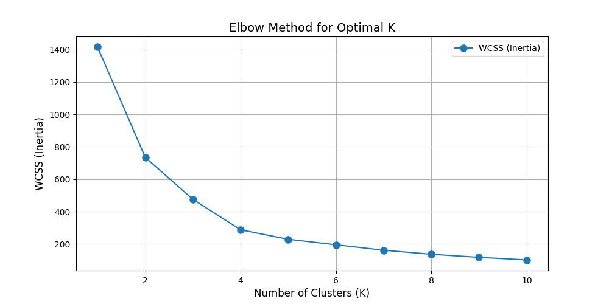

# Determining the Optimal Number of Clusters Using Elbow Method

## Introduction
This document presents the analysis results for determining the optimal number of clusters in the dataset (Min_Max Scaled data) using the Elbow Method. This is the initial phase of the clusering analysis before training the K-means model. 

## Elbow Method Analysis

The Elbow Method is a heuristic used to determine the number of clusters in a dataset. The idea is to run the k-means clustering algorithm for a range of values of **k** (the number of clusters) and calculate the sum of squared distances from each point to its assigned cluster center (also known as the within-cluster sum of squares, or WCSS). 

### Steps Taken:
1. **Data Preparation**: The dataset was preprocessed to ensure all features are in the correct format.
2. **K-Means Clustering**: The k-means algorithm was run for **k** values ranging from 1 to 10.
3. **WCSS Calculation**: The WCSS for each value of **k** was calculated.
4. **Plotting**: The results were visualized to identify the "elbow" point.

## Results

### WCSS Values
| Number of Clusters (k)  | WCSS    |
|-------------------------|---------|
| 1                       | 1415.3  |
| 2                       | 735.1   |
| 3                       | 475.6   |
| 4                       | 287.8   |
| 5                       | 229.5   |
| 6                       | 195.4   |
| 7                       | 161.9   |
| 8                       | 136.9   |
| 9                       | 117.9   |
| 10                      | 102.1   |

### Elbow Method Visualization

In the plot above, the WCSS decreases as the number of clusters increases. The "elbow" point occurs at **k = 4**, indicating that adding more clusters beyond this point yields diminishing returns in terms of reduced WCSS.

## Conclusion
Based on the Elbow Method analysis, the optimal number of clusters for the dataset is identified as **4**. This number balances the complexity of the model with the variance explained by the clusters, making it a suitable choice for further analysis.

## Next Steps

Apply the k means model on the dataset with the number of cluster identified as 4.
Visualise the cluster and analyse the characterstics

