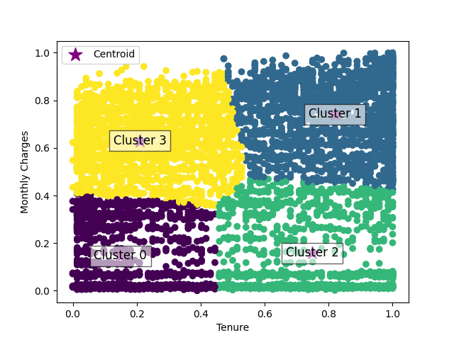

# Training the Clustering Model and Anlysis
## Introduction
In the initial phase of our clustering analysis, we applied the elbow method to determine the optimal number of clusters, finding that optimal number of cluster were 4 for the Min_Max scaled data.

This document outlines the phase where we train the clustering model using the optimal number of clusters (4) and analyse the resulting cluster characteristics.

## Steps
1. Training the K-means Model
Train the K-means model with the detemined optimal number of cluster (4). The model will be trained on the Min-Max scaled data. The DataFrame with cluster assignments is saved to scaled_df_n_clusters.
Make sure to install necessary library required for running the script. 

```python
# function to train the k_means model
def apply_k_means(scaled_df_n_clusters, data, n_clusters):
    
   """

    Args:
        scaled_df_n_clusters: The Min_max Scaled dataframe containing customer data.
        data: Contains the features used for clustering (tenure and MonthlyCharges).
        n_clusters: The optimal number of cluster determined from elbow method.
        visualisations_path : The path to save the visualisations 
    
    Returns:
        kmeans (KMeans): The trained KMeans model.
        scaled_df_n_clusters : The input dataframe with an additional column for cluster labels.
        
    """
    
    # Apply KMeans clustering
    kmeans = KMeans(n_clusters=n_clusters, init='k-means++', n_init=10, random_state=42)
    kmeans.fit(data)
    
    # Add the cluster labels to the DataFrame
    scaled_df_n_clusters['clusters_4'] = kmeans.labels_
    print(scaled_df_n_clusters)
    
    # Scatter plot for clusters
    plt.scatter(x=scaled_df_n_clusters['tenure'], y=scaled_df_n_clusters['MonthlyCharges'], 
                c=scaled_df_n_clusters['clusters_4'], cmap='viridis')
    
    # Scatter plot for centroids
    plt.scatter(kmeans.cluster_centers_[:, 0], kmeans.cluster_centers_[:, 1], 
                color='purple', marker='*', s=200, label='Centroid')
    
    # Label each centroid with its cluster number
    for i, centroid in enumerate(kmeans.cluster_centers_):
        plt.text(centroid[0], centroid[1], f'Cluster {i}', fontsize=12, color='black', 
                 ha='center', va='center', bbox=dict(facecolor='white', alpha=0.6, edgecolor='black'))
    
    # Axis labels
    plt.xlabel('Tenure')
    plt.ylabel('Monthly Charges')
    plt.legend(loc='best')
    
    # Save the plot
    optimal_cluster_path = os.path.join(visualisations_path, 'optimal_clusters.png')
    plt.savefig(optimal_cluster_path)
    
    # Display the plot
    plt.show()
    return kmeans, scaled_df_n_clusters

```


### Cluster Visualizations


## Cluster Characteristics

The following describes the characteristics of each cluster based on tenure and charges:

| Position           | Cluster Number | Characteristics                       |
|--------------------|----------------|---------------------------------------|
| **Top-left**       | Cluster 0      | Low tenure, low charges               |
| **Top-right**      | Cluster 1      | High tenure, high charges             |
| **Bottom-left**    | Cluster 2      | Mid-high tenure, low-mid charges      |
| **Bottom-right**   | Cluster 3      |High tenure, mid-high charges          |

## Customer Segmentation Analysis

This plot could be part of a customer segmentation analysis. Clusters might represent different customer types based on how long they’ve been customers (tenure) and how much they pay (monthly charges):

- **Cluster 0**: Customers with short tenure and low charges. This group might represent new or         low-engagement customers who are not paying much and might require targeted marketing strategies to retain them.
- **Cluster 1**: Loyal, high-paying customers with long tenure and high monthly charges. These are the most valuable customers.
- **Cluster 2**: Customers with moderate tenure and low charges. This group is most at risk of churn since they have not been with the company long and are not heavily invested in high-value services.
- **Cluster 3**: Long-term customers with mid-high charges. This group might represent stable customers who have been with the service for a long time and contribute to consistent revenue.

This categorization helps in understanding the customer segments and tailoring marketing strategies accordingly.

## Next steps
- Visualise the clusters based on the some cluster characterstics.
