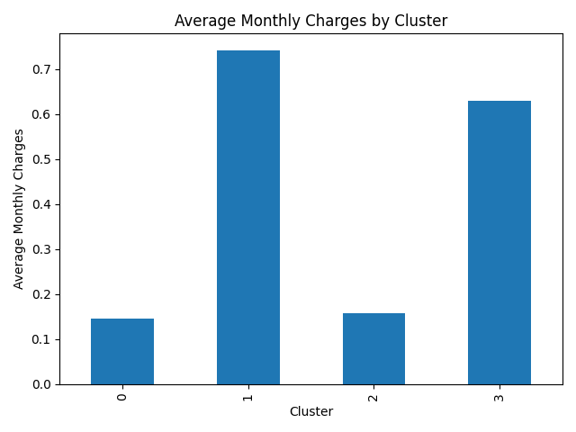
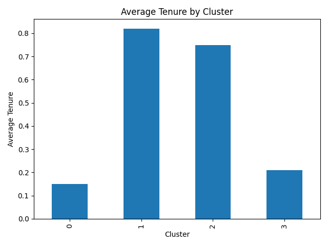
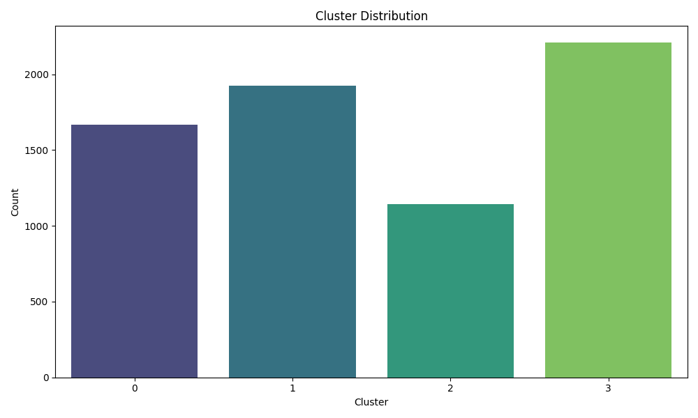

# Visualisations of clusters on some cluster Characterstics

### Visualization 1: Cluster Visualization

## Cluster Characteristics

The following describes the characteristics of each cluster based on tenure and charges:

| Position           | Cluster Number | Characteristics                       |
|--------------------|----------------|---------------------------------------|
| **Top-left**       | Cluster 0      | Low tenure, low charges               |
| **Top-right**      | Cluster 1      | High tenure, high charges             |
| **Bottom-left**    | Cluster 2      | Mid-high tenure, low-mid charges      |
| **Bottom-right**   | Cluster 3      |High tenure, mid-high charges          |

## Customer Segmentation Analysis

This plot could be part of a customer segmentation analysis. Clusters might represent different customer types based on how long they’ve been customers (tenure) and how much they pay (monthly charges):

- **Cluster 0**: Customers with short tenure and low charges. This group might represent new or         low-engagement customers who are not paying much and might require targeted marketing strategies to retain them.
- **Cluster 1**: Loyal, high-paying customers with long tenure and high monthly charges. These are the most valuable customers.
- **Cluster 2**: Customers with moderate tenure and low charges. This group is most at risk of churn since they have not been with the company long and are not heavily invested in high-value services.
- **Cluster 3**: Long-term customers with mid-high charges. This group might represent stable customers who have been with the service for a long time and contribute to consistent revenue.

This categorization helps in understanding the customer segments and tailoring marketing strategies accordingly.

### Visualization 2: Average Monthly Charges by Cluster

## Key Points:
- **X-axis (Cluster)**: Each bar represents a cluster (0, 1, 2, 3), corresponding to the clusters identified.
- **Y-axis (Average Monthly Charges)**: The height of each bar indicates the average monthly charges for customers in that cluster.
## Analysis:
- **Cluster 1**: This cluster has the highest average monthly charges, just above 0.7 (in normalized values). It represents customers with the highest spending, possibly indicating high-value customers.

- **Cluster 3**: This cluster has the second highest average monthly charges, slightly above 0.6.
These customers likely have relatively high monthly charges but might differ from Cluster 1 in terms of tenure or some other feature.
- **Cluster 2 and Cluster 0**: These clusters show much lower average monthly charges, around 0.1 to 0.2, indicating customers who spend much less. These clusters likely correspond to customers with lower tenure and charges, representing possibly low-value or new customers.
## Overall Insights:
Clusters 1 and 3 represent higher-paying customers, while Clusters 0 and 2 likely contain customers with lower monthly charges.

### Visualization 2: Average Tenure by Cluster 

## Key points
- **X-axis (Cluster)**: Each bar represents a cluster (0, 1, 2, 3), corresponding to the clusters identified.
- **Y-axis (Average Tenure)**: The height of each bar indicates the average tenure for customers in that cluster.

## Analysis
- **Cluster 0**: This cluster has a significantly lower average tenure compared to the other clusters, as depicted by the comparatively short bar.
- **Cluster 1**: This cluster shows the highest average tenure among the four, indicated by the tallest bar.
- **Cluster 2**: This cluster has a slightly lower average tenure than cluster 1, but still substantially higher than clusters 0 and 3.
- **Cluster 3**: This cluster has an average tenure that looks similar to that of cluster 0, which is again much lower than clusters 1 and 2.

## Overall Insights
The tenure chart suggests that while Clusters 1 and 2 have longer tenure, Cluster 1 stands out as the group with the highest tenure and charges. Cluster 0 has the shortest tenure, confirming it contains the newest customers.

### Visualization 2: Cluster Distribution 

## Key points
- **X-axis (Cluster)**: Each bar represents a cluster (0, 1, 2, 3), corresponding to the clusters identified.
- **Y-axis (Count)**: The height of each bar indicates the count of customers in that cluster.

## Analysis
- **Cluster 3**: This cluster has the largest number of customers, with over 2000 individuals. This suggests that a significant portion of customers fall into the category of high tenure with mid-high charges. 

- **Cluster 1**: The second largest group, with around 1800 customers, represents those with high tenure and high charges. This further highlights the importance of this group as high-value, long-term customers who might be loyal to the brand.

- **Cluster 0**: With approximately 1600 customers, this cluster is relatively large as well. These customers are characterized by low tenure and low charges, indicating they might be newer or less engaged.

- **Cluster 2**: This cluster has the fewest customers, with a count of just over 1000. These customers have mid-high tenure and low-mid charges, making them the most likely group at risk of churn due to lower engagement. 
